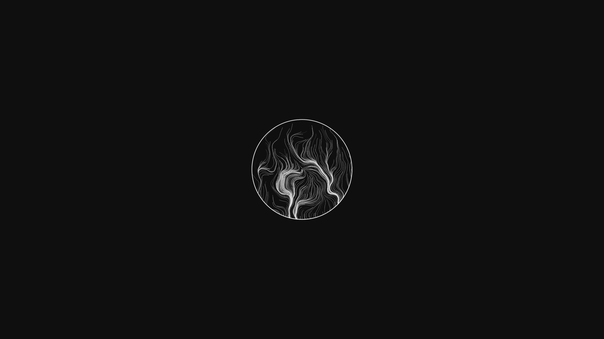
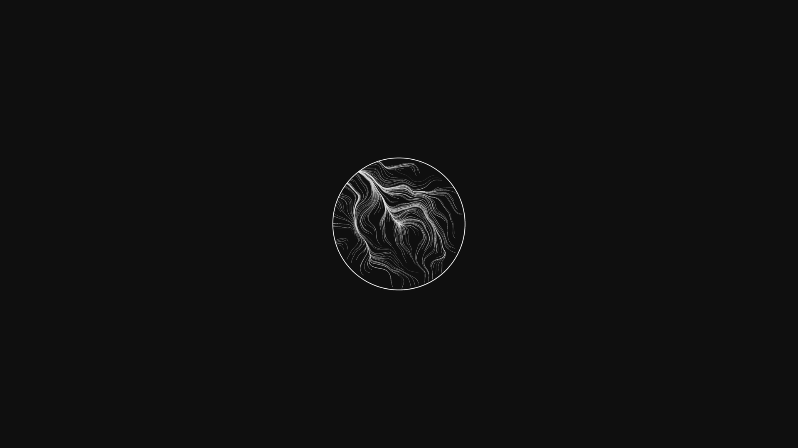
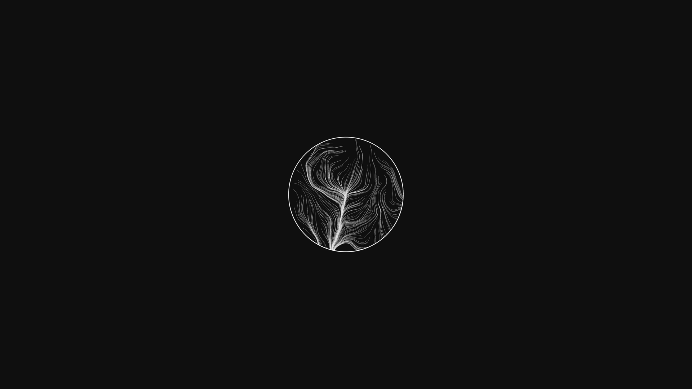

# Lunar Eclipse

  
  

  
  

As I often do, I created this repository way back *(the first commit is dated 22 of February 2022)* and left it to rot in the dark corners of GitHub's server.
The funniest thing is that the whole project is complete and has been for at least a year, but I didn't want to write two lines of readme and make it public.

Anyway, here we go.

See the output below and other stuff I have done on my [Instagram Profile](https://www.instagram.com/lorossi97/) and on my [website](https://lorenzoros.si/).

## Why, what and how

I originally made this because I felt inspired of something I saw on my Instagram feed and is now long gone in the depths of the internet.
I don't even know the real purpose anymore; initially, I wanted to generate a big amount of pictures and use them as a background leveraging GNOME 3's ability to change background every set amount of time.
For a while I did that, but then I got bored and stopped.

Looking back, I could have named this a million different ways, as it's something so abstract that I don't even know what this represents, actually.

I made this using my [Canvas Boilerplate](https://github.com/lorossi/empty-html5-canvas-project), which is a simple wrapper around the HTML5 canvas element and includes a few useful modules to help my (not so) creative process in creating useless web experiments (*that could and should be desktop applications instead)*.
The lines are generated using a Simplex Noise algorithm, hence rendering a single image can take upward to 5 seconds each.
It does not really help that each image is 1000x1000px with 400 lines of 20 nodes each, but I wanted to make them as detailed as possible and I quite like the output.

The repo also contains two scripts *(`batch-resize.sh` and `resize-background.sh`)* that helped me in creating the background images for my desktop.
The other script *(`set-background.sh`)* is a simple wrapper around `gsettings` that sets the background image to the one passed as argument.
It needs GNOME 3 to be installed, but I'm fairly sure it can be adapted to other desktop environments.
I recently switched to KDE, so I don't really know if this still works *(given that GNOME developers like to break stuff at each release)*, but I'm pretty confident it does.

Technically, this is not a complex project as all it does is drawing lines and displacing them by random amounts thanks to the aforementioned noise function;
as easy as it is, the result is quite complex and pleasing to the eye.
This represent what I like the most about computer graphics and digital art *(if I can say so myself)*: sometimes you spend ages writing complex functions that create a simple output, while sometimes a few lines of code can create something complex and beautiful *(as I hope you find this)*.

## Usage

### Web application

Since generating an image takes quite a long while, I decided to implement these keyboard shortcuts to make the process easier:

- press `ENTER` to download the current image
- press `Q` to switch to high quality mode *(which is slower)*
- press `W` to switch to low quality mode *(which is faster, active by default)*
- press `E` to generate a new frame
  - can be also activated by clicking on the canvas

I recommend opening the developer console *(`F12`)* to see the progress of the generation process.

Notice that each generated image has different parameters for the noise function, so they could look quite different from each other *(some images have smoother lines, some have rougher)*.

### How to create infinite backgrounds for your pc

This is the complete workflow I used to create the backgrounds for this repo:

1. host the `index.html` file on a web server
    - if you have python installed, you can simply run `python -m http.server` in the root of the project
2. open the page in your browser
3. press `E` until you find a frame you like, then generate it in high quality mode by pressing `Q`, wait for it to finish, and finally press `ENTER` to download it
4. use the `resize-background.sh` script to resize the image to your screen resolution
   - you will need `imagemagick` installed for this to work, the script will prompt you to install it if it's not found
   - the first parameter is the source image
   - the second is by how much the circle should be scaled *(by default it's 0.4)*
   - the final image is the output path *(by default it's `background.png`)*
5. manually set the generated image as background.

### How to auto change background on GNOME 3

**IMPORTANT:** this requires GNOME 3 to be installed.

If you create multiple background images, you can automate the process of changing the background automatically by:

- editing the `set-background.sh` script and changing the `BACKGROUND_PATH` variable to the path of the folder containing the images
- creating a `cron` job that runs the script every set amount of time
  - for example, if you want to change the background every 5 minutes, you can run `crontab -e` and add the following line: `*/5 * * * * /path/to/set-background.sh`
  - this will run the script every 5 minutes, changing the background to a random image in the folder

## Output

## Credits

This project is distributed under MIT license.

Font [Roboto](https://fonts.google.com/specimen/Roboto), made by Google, is packaged in this repository.
